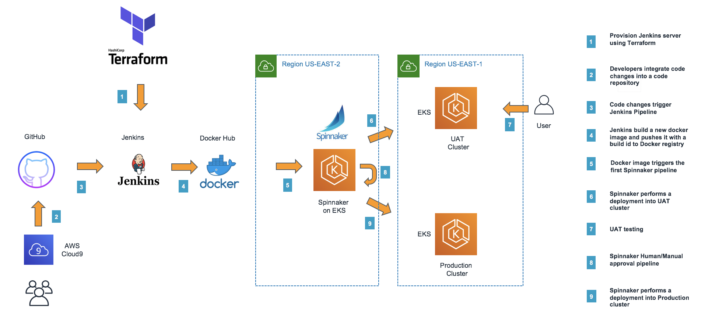

# Continuous Intergration on Amazon EKS



# Spring PetClinic Sample Application [](https://travis-ci.org/spring-projects/spring-petclinic/)

## Understanding the Spring Petclinic application with a few diagrams


## Running petclinic locally
Petclinic is a [Spring Boot](https://spring.io/guides/gs/spring-boot) application built using [Maven](https://spring.io/guides/gs/maven/). You can build a jar file and run it from the command line:


```
git clone https://github.com/spring-projects/spring-petclinic.git
cd spring-petclinic
./mvnw package
java -jar target/*.jar
```

You can then access petclinic here: http://localhost:8080/


Or you can run it from Maven directly using the Spring Boot Maven plugin. If you do this it will pick up changes that you make in the project immediately (changes to Java source files require a compile as well - most people use an IDE for this):

```
./mvnw spring-boot:run
```
